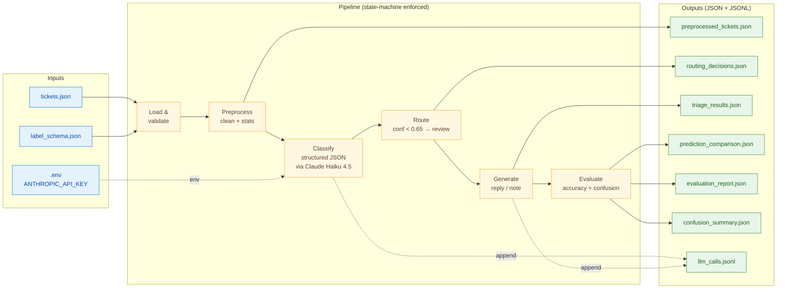
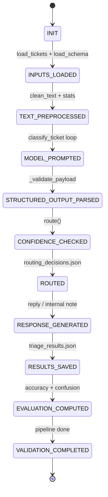
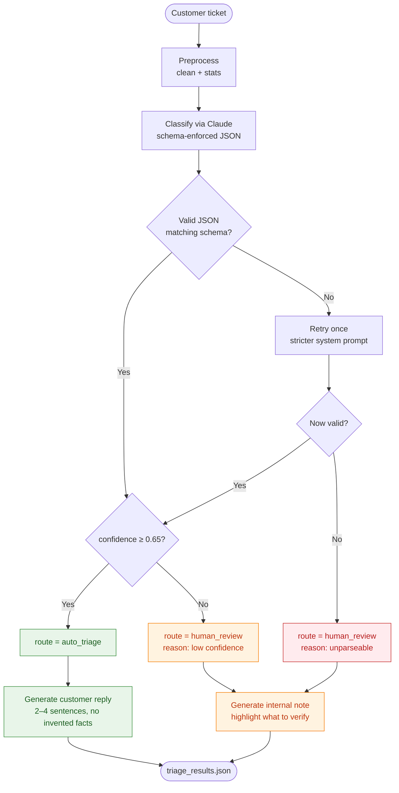
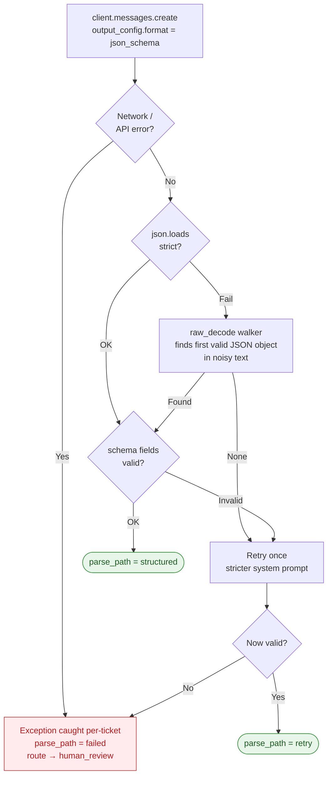
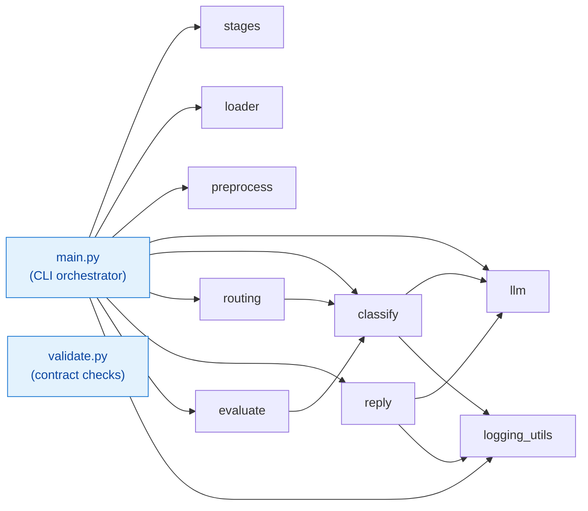

# TriageTic

> A small, replayable, AI-powered customer-support **ticket triage pipeline**.
> Reads tickets from disk, classifies each with schema-enforced JSON via Claude,
> routes low-confidence cases to human review, drafts replies for the rest, and
> self-validates every artifact it produces.

---

## At a glance



---

## What it does (and what it does not)

| Does | Does not |
|---|---|
| Reads `tickets.json` + `label_schema.json` from disk | Connect to any ticketing system |
| Classifies each ticket into `{category, urgency, confidence, reasoning, needs_review}` via Claude with **schema-enforced JSON** | Trust the LLM's `needs_human_review` flag for routing |
| Routes by **deterministic code** (`confidence < 0.65` → human) | Block on any single failure — per-ticket exceptions are isolated |
| Drafts replies that acknowledge the issue without inventing account facts | Promise specific actions, refunds, or timelines |
| Logs every LLM call with sha256 prompt hash + raw output artifact | Cache prompts (too few tickets to pay back the write premium) |
| Self-validates every contract via `validate.py` | Need network access for the test suite |

---

## Architecture

### 1. Pipeline state machine

The spec mandates explicit stages. `pipeline/stages.py` enforces them in code:
`StageTracker.advance()` rejects backward transitions and stage skips. Every
artifact write happens at exactly one stage.



### 2. Per-ticket decision flow

The routing decision is taken by code, not the model. The LLM's
`needs_human_review` hint is intentionally ignored — `pipeline/routing.py`
makes the final call based on confidence alone (and on parse success).



### 3. Defense in depth: how malformed output is handled

Spec §8 asks for **one** recovery path. The implementation has **four** layered
defenses, each catching a different failure mode:



Layer 1 — **`output_config.format`** with a JSON Schema (enum + required +
`additionalProperties: false`) gets the API itself to enforce the structure
server-side. In practice the next layers almost never fire.

Layer 2 — strict `json.loads` of the response text.

Layer 3 — **brace-walking** `json.JSONDecoder.raw_decode()` that locates the
first balanced JSON object even when the model added prose around it.
(Strictly better than the naive `\{.*\}` regex, which is greedy and breaks on
inputs containing multiple `{` characters.)

Layer 4 — one **retry with a stricter system prompt**. If that still fails,
the ticket is routed to human review with the error logged.

### 4. Module dependency graph



---

## Quickstart

```bash
git clone https://github.com/Abhishekgupta1223/TriageTic.git
cd TriageTic
pip install -r requirements.txt

cp .env.example .env
# open .env, paste your Anthropic API key (https://console.anthropic.com/)

python main.py        # run the pipeline end-to-end
python validate.py    # check every spec contract
pytest -q             # 30 unit tests
```

Or with Make:

```bash
make install   # pip install
make all       # run + validate + test
make clean     # remove generated artifacts
```

### CLI

```bash
python main.py \
  --tickets tickets.json \
  --schema label_schema.json \
  --out . \
  --model claude-haiku-4-5 \
  --confidence-threshold 0.65
```

| Flag | Default | Purpose |
|---|---|---|
| `--tickets` | `tickets.json` | Input file (list of tickets) |
| `--schema` | `label_schema.json` | Allowed categories + urgency levels |
| `--out` | `.` | Output directory for all artifacts |
| `--model` | `claude-haiku-4-5` | Any Claude model that supports `output_config.format` |
| `--confidence-threshold` | `0.65` | Below this, ticket routes to human review |

---

## Project layout

```
TriageTic/
├── main.py                       # CLI orchestrator; state-machine driver
├── validate.py                   # Spec §7 contract checker (exit non-zero on fail)
├── tickets.json                  # Sample inputs (spec-provided; evaluator may swap)
├── label_schema.json
├── .env.example                  # Template — copy to .env, fill in key
├── requirements.txt
├── Makefile                      # install / run / validate / test / clean
├── README.md                     # this file
│
├── pipeline/
│   ├── stages.py                 # PipelineStage enum + StageTracker
│   ├── loader.py                 # JSON load + structural validation
│   ├── preprocess.py             # Deterministic text cleaning + stats
│   ├── llm.py                    # Anthropic SDK wrapper (call_structured / call_text)
│   ├── classify.py               # Schema-enforced classification + JSON recovery + retry
│   ├── routing.py                # Deterministic confidence routing
│   ├── reply.py                  # Customer reply + internal note generation
│   ├── evaluate.py               # Accuracy, comparison, confusion matrix
│   └── logging_utils.py          # CallLogger → llm_calls.jsonl + raw artifacts
│
└── tests/                        # 30 tests, no network required
    ├── test_routing.py           # Threshold boundary + override-model-flag tests
    ├── test_schema.py            # Validation + 4 JSON-recovery edge cases
    ├── test_metrics.py           # Accuracy + parse-failure exclusion + confusion
    └── test_security.py          # Path traversal + bad-input rejection
```

---

## Design decisions (and why)

| Decision | Rationale |
|---|---|
| **Schema-enforced JSON via `output_config.format`** | Eliminates most parse failures by construction — the API enforces the schema server-side. Leaves recovery code as defense-in-depth, not the happy path. |
| **Deterministic routing in code, not the LLM** | Spec is explicit: `needs_human_review` from the model is a hint, not the decision. Confidence threshold is the source of truth. |
| **State machine over loose stage labels** | `StageTracker.advance()` rejects skips and backward transitions. Makes the pipeline grep-able by reviewers and prevents silent reordering during refactors. |
| **One retry with a stricter prompt** (vs. retry-on-temperature-bump) | `temperature=0` already gives us the model's most-likely output. A stricter system prompt is what changes between attempts. |
| **`raw_decode()` brace-walker over regex** | `\{.*\}` is greedy — it captures from the FIRST `{` to the LAST `}`, breaking on common LLM outputs with prose containing braces. `json.JSONDecoder.raw_decode()` finds the first *valid* object. |
| **Per-ticket exception isolation** | A single rate-limit or timeout shouldn't take down the whole batch. Failed tickets are routed to human review with the error logged. |
| **Filename sanitization** | Untrusted `ticket_id` flows into filenames. `_safe_segment()` strips `..`, slashes, and Windows-illegal characters. |
| **`temperature=0` + sha256 prompt hashing** | Same inputs → same hash → reproducible logs. Useful for diff-testing against future runs. |
| **No prompt caching** | Minimum cacheable prefix on Haiku 4.5 is 4096 tokens. Our system prompts don't reach that, and 10 tickets per run don't pay back the cache-write premium. |

---

## Generated artifacts (spec §"Required Artifacts")

| Artifact | Written by | Contents |
|---|---|---|
| `preprocessed_tickets.json` | `pipeline/preprocess.py` | `ticket_id, original_text, cleaned_text, char_count, word_count` |
| `routing_decisions.json` | `pipeline/routing.py` | `ticket_id, route, confidence, routing_reason` |
| `triage_results.json` | `main.py` | `ticket_id, predicted_*, confidence, route, customer_reply, internal_note` |
| `prediction_comparison.json` | `pipeline/evaluate.py` | Per-ticket expected vs predicted, with match flags |
| `evaluation_report.json` | `pipeline/evaluate.py` | `category_accuracy, urgency_accuracy, human_review_count, parse_validation_failures` |
| `confusion_summary.json` | `pipeline/evaluate.py` | Confusion matrix + `most_confused_pairs` (stretch) |
| `llm_calls.jsonl` | `pipeline/logging_utils.py` | One JSON record per LLM call (stage, ticket_id, timestamp, provider, model, prompt_hash, output_artifact) |
| `llm_outputs/{stage}_{ticket_id}[_retry].json` | `pipeline/logging_utils.py` | Raw model response for every call |

All artifacts are regenerated from scratch on every run. The evaluator can delete them and rerun.

---

## Spec compliance matrix

Mapping every "MUST" from the spec to where it lives in code.

| Spec requirement | Implementation |
|---|---|
| Load `tickets.json` + `label_schema.json` | `pipeline/loader.py` |
| Deterministic preprocessing (whitespace, length stats, punctuation) | `pipeline/preprocess.py:clean_text` |
| Write `preprocessed_tickets.json` with `ticket_id / original_text / cleaned_text / char_count / word_count` | `pipeline/preprocess.py:preprocess_ticket` + `main.py:run` |
| Prompt includes allowed labels from schema | `pipeline/classify.py:build_user_prompt` |
| Model returns valid JSON only | `pipeline/classify.py:CLASSIFY_SYSTEM` + `output_config.format` |
| Parse and validate response | `pipeline/classify.py:_try_parse` + `_validate_payload` |
| Invalid category/urgency rejected in code | `pipeline/classify.py:_validate_payload` |
| Routing is deterministic, not the LLM's flag | `pipeline/routing.py:route` (ignores `parsed.needs_human_review`) |
| `confidence < 0.65` → `human_review` | `pipeline/routing.py:DEFAULT_CONFIDENCE_THRESHOLD` + comparison |
| Invalid/unparsable output → `human_review` with reason | `pipeline/routing.py:route` (handles `parse_path == "failed"`) |
| Customer reply: 2–4 sentences, no invented facts, consistent with prediction | `pipeline/reply.py:REPLY_SYSTEM` |
| Internal note for `human_review` cases | `pipeline/reply.py:generate_internal_note` |
| Reply only for `auto_triage`; note only for `human_review` | `main.py:run` (route-dispatched generation) |
| Compute category accuracy, urgency accuracy, review count, parse failures | `pipeline/evaluate.py:evaluation_report` |
| Per-ticket comparison report | `pipeline/evaluate.py:per_ticket_comparison` |
| `llm_calls.jsonl` with all required fields per call | `pipeline/logging_utils.py:CallLogger.log` |
| Validation command | `validate.py` |
| Recovery path for malformed output (§8) | `pipeline/classify.py:_extract_first_json_object` + retry |
| Lightweight tests for routing, schema, metrics (§9) | `tests/test_routing.py`, `test_schema.py`, `test_metrics.py` |
| CLI with `--tickets / --schema` flags (§10) | `main.py:parse_args` |
| Confusion summary (§11, stretch) | `pipeline/evaluate.py:confusion_summary` |

---

## Testing

```bash
pytest -q
```

**30 tests, all pure-Python, no network required:**

| File | Covers |
|---|---|
| `tests/test_routing.py` | Threshold boundary (0.64 vs 0.65), failed-parse → review, model's `needs_human_review` flag does NOT override deterministic routing |
| `tests/test_schema.py` | Valid payloads accepted, invalid category/urgency/confidence rejected, JSON recovery handles strict / noisy / multi-object / nested-brace inputs |
| `tests/test_metrics.py` | Accuracy computation, parse failures excluded from accuracy denominator, confusion matrix correctness |
| `tests/test_security.py` | Path traversal stripped from filenames, illegal Windows chars stripped, empty/whitespace/non-string ticket_id rejected, duplicates rejected |

---

## Configuration

The `.env` file is the only place secrets live. Template:

```dotenv
ANTHROPIC_API_KEY=sk-ant-...
# ANTHROPIC_MODEL=claude-haiku-4-5     # optional override
# CONFIDENCE_THRESHOLD=0.65            # optional override
```

`.env` is gitignored. `.env.example` is the committed template.

If you prefer plain env vars:

```bash
export ANTHROPIC_API_KEY=sk-ant-...    # bash / zsh
$env:ANTHROPIC_API_KEY = "sk-ant-..."  # PowerShell
```

---

## Cost transparency

Default model is `claude-haiku-4-5` at $1/M input, $5/M output tokens.
A typical run on the 6 sample tickets uses roughly:

- ~6 classification calls × ~600 input + ~150 output tokens
- ~6 reply / note calls × ~400 input + ~200 output tokens
- ≈ **6,000 input + 2,100 output tokens** total
- ≈ **$0.02 per full pipeline run**

(With ~10 tickets, expect ≲ $0.04.)

---

## Tech stack

- **Python ≥ 3.10** (uses PEP 604 union types, PEP 585 generics)
- **`anthropic` ≥ 0.40.0** — official Anthropic SDK
- **`python-dotenv`** — `.env` loader
- **`pytest`** — test runner (only required for development)

No web framework, no DB, no async — sequential per-ticket processing is the
right size for the 10-ticket batch the spec calls out.

---

<p align="center">
  made with ❤️ by <strong>Abhishek Gupta</strong>
</p>
